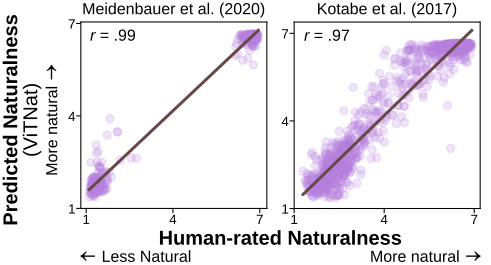
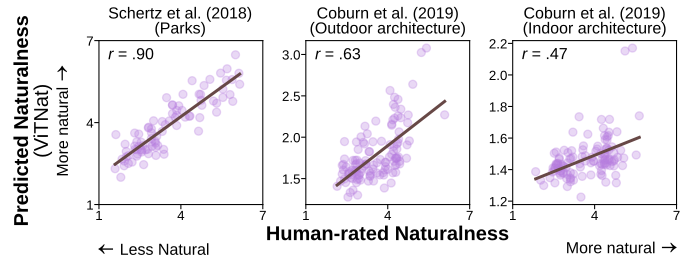

# ViTNat

ViTNat is a fine-tuned Vision Transformer (ViT) model that predicts the *naturalness* of a scene. It is based on the [`google/vit-base-patch16-224-in21k`](https://huggingface.co/google/vit-base-patch16-224-in21k) model available on Hugging Face.

# 🔧 Quick Start

The fine-tuned model weights are available at: [https://huggingface.co/nwrim/ViTNat](https://huggingface.co/nwrim/ViTNat)

To download the model, you can follow the [official guide](https://huggingface.co/docs/huggingface_hub/en/guides/download). One simple method is to use the Hugging Face CLI:
```sh
huggingface-cli download nwrim/ViTNat
```
Once downloaded, you can run a prediction on an image (see **Dependencies** below for required packages):

```python
from transformers import ViTImageProcessor, ViTForImageClassification
from PIL import Image

# Load your image
image = Image.open('path/to/image')

# Load processor and model
processor = ViTImageProcessor.from_pretrained('nwrim/ViTNat')
model = ViTForImageClassification.from_pretrained('nwrim/ViTNat', num_labels=1)

# Process image and get prediction
inputs = processor(images=image, return_tensors="pt")
outputs = model(**inputs)

# The output is a regression score indicating naturalness
print(outputs.logits)
```
> [!NOTE]  
> Although the model class is `ViTForImageClassification`, it is configured for regression by setting `num_labels=1`. More info [here](https://discuss.huggingface.co/t/using-vitforclassification-for-regression/10716).

### Prediction for a directory of images

You can also compute ViTNat predictions for all files in a directory using the script `vitnat_predict_directory.py`:

```sh
python vitnat_predict_directory.py \
  --image_dir /path/to/images \
  --output_path /path/to/output.csv
```

This will generate a CSV file with naturalness predictions for each image.

* Accepts a directory of images (assumes all files in the directory are in a format readable by PIL)
* Applies ViTNat to each image
* Outputs a CSV with two columns: `image_name`, `vitnat` (the prediction)

# 🏞️ Train and Validation Set

We used **Image Set 3** from Rim et al. (2025) (see citation below), which contains 1,670 images from 334 categories (5 images per category) in the [SUN397 database](https://vision.princeton.edu/projects/2010/SUN/), to train the model.

The **training set** was created by randomly sampling 4 images from each category, resulting in 1,336 images (note: category labels were not used in training). The **validation set** comprised the remaining 334 images from Image Set 3.

The images used in the training and validation sets can be downloaded [here](https://osf.io/5bwgu). Human naturalness ratings for these images are available [here](https://github.com/nwrim/naturalness_compression_memorability).

# 📈 Out-of-sample performance

We tested the out-of-sample performance of ViTNat by correlating its predictions with human naturalness ratings from two datasets:

* [Meidenbauer et al. 2020](https://doi.org/10.1016/j.jenvp.2020.101498)
* [Kotabe et al. (2017)](https://doi.org/10.1037/xge0000321) 

The plot below shows ViTNat’s performance on these two datasets:



As a more conservative benchmark, we tested ViTNat on:


* [Schertz et al. (2018)](https://doi.org/10.1016/j.cognition.2018.01.011), which contains only park scenes

* [Coburn et al. (2019)](https://doi.org/10.1016/j.jenvp.2019.02.007), which includes only human-made, architectural scenes

The plot below shows ViTNat’s performance on these two domain-restricted datasets:



# 📦 Dependencies
To install all required packages, use the provided `requirements.txt` file:

```sh
pip install -r requirements.txt
```

Alternatively, you can install the core packages manually. This project was developed with the following versions:
* `python==3.8.19`
* `pandas==1.52`
* `scikit-learn==1.3.2`
* `pillow==10.2.0`
* `torch==2.4.1+cu121`
* `torchaudio==2.4.1+cu121`
* `torchvision==0.19.1+cu121`
* `datasets==2.21.0`
* `transformers==4.44.2`